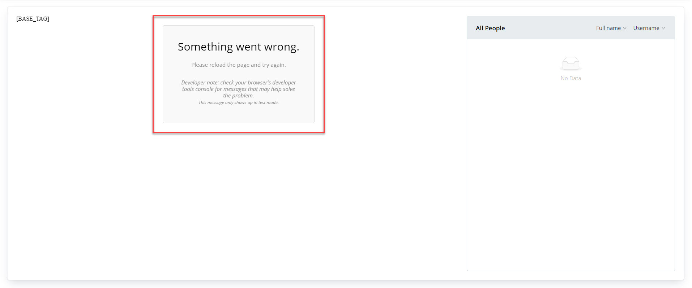

1. Rename `.env.example` to `.env`

# Known issue
1. Whenever encounter this error, it's usually because I've just reset the Talkjs data on the server.

- Hot fix: Uncomment this line in the component `Message.tsx` will fix (or hide) the problem
```diff
-selected: localStorage.getItem(LAST_SELECTED_CONVERSATIONID_STORAGE_KEY) || undefined,
+//selected: localStorage.getItem(LAST_SELECTED_CONVERSATIONID_STORAGE_KEY) || undefined,
```
- To fix formally: Whenever reseting the Talkjs data on the server, change the variable `LAST_SELECTED_CONVERSATIONID_STORAGE_KEY` to something else:
```diff
-const LAST_SELECTED_CONVERSATIONID_STORAGE_KEY = 'old_key'; 
+const LAST_SELECTED_CONVERSATIONID_STORAGE_KEY = 'new_key'; 
```
- Better I could make it an environment variable, but I don't care for now


# Ant Design Pro

This project is initialized with [Ant Design Pro](https://pro.ant.design). Follow is the quick guide for how to use.

## Environment Prepare

Install `node_modules`:

```bash
npm install
```

or

```bash
yarn
```

## Provided Scripts

Ant Design Pro provides some useful script to help you quick start and build with web project, code style check and test.

Scripts provided in `package.json`. It's safe to modify or add additional script:

### Start project

```bash
npm start
```

### Build project

```bash
npm run build
```

### Check code style

```bash
npm run lint
```

You can also use script to auto fix some lint error:

```bash
npm run lint:fix
```

### Test code

```bash
npm test
```

## More

You can view full document on our [official website](https://pro.ant.design). And welcome any feedback in our [github](https://github.com/ant-design/ant-design-pro).
